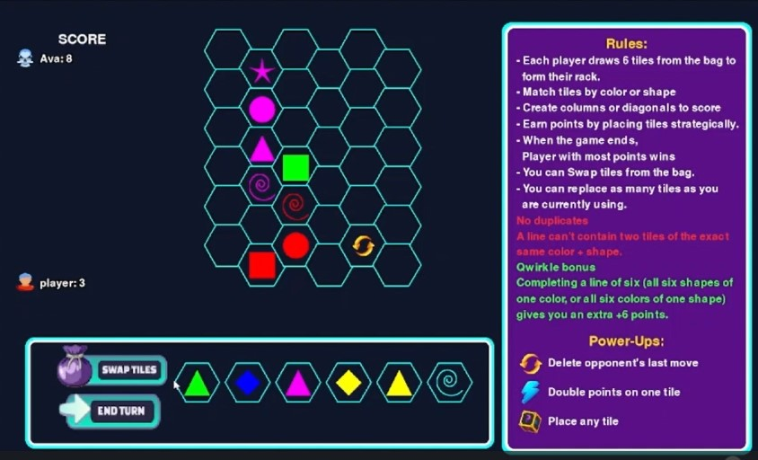

# Smart Qwirkle

**AI‑Powered Hexagonal Tile‑Matching Game**

## Table of Contents

* [Description](#description)
* [Features](#features)
* [Installation](#installation)
* [Usage](#usage)
* [Project Report](#project-report)
* [Demo Video](#demo-video)
* [Team](#team)
* [License](#license)

---

## Description

Smart Qwirkle is an enhanced version of the classic Qwirkle board game, featuring:

* **Hexagonal Grid**: Axial‑coordinate layout for six directions of play.
* **AI Opponents**: Three difficulty levels—Easy (uninformed search), Medium (heuristic evaluation), Hard (Minimax + alpha‑beta pruning).
* **Power‑Ups**: Strategic tiles (UNDO, DOUBLE, WILD) that alter scoring and placement rules.
* **Interactive UI**: Built with Python and Pygame for drag‑and‑drop tile placement and real‑time feedback.

---

## Features

* **Hexagonal Board**: Flexible placement along six axes.
* **Rule Enforcement**: Matches by color or shape, with full validation and scoring (including +6 bonus for a complete line of six).
* **AI Strategy**: Adjustable AI opponents to suit beginners up to advanced players.
* **Power‑Ups**:

  * **UNDO**: Revert the last move.
  * **DOUBLE**: Double your score for a turn.
  * **WILD**: Place anywhere, ignoring matching constraints.
* **Responsive Graphics**: Smooth animations and clear highlighting of valid moves.

---

## Installation

1. **Clone the repository**

   ```bash
   git clone https://github.com/your-username/smart-qwirkle.git
   cd smart-qwirkle
   ```
2. **Create a virtual environment** (optional but recommended)

   ```bash
   python3 -m venv venv
   source venv/bin/activate   # Linux/macOS
   venv\Scripts\activate     # Windows
   ```
3. **Install dependencies**

   ```bash
   pip install -r requirements.txt
   ```

---

## Usage

Run the main game script:

```bash
python game.py
```

Follow the on‑screen prompts to select game mode (Human vs. AI) and AI difficulty.

---

## Project Report

A detailed project report is available here:

[📄 Project Report Document](https://docs.google.com/document/d/1tKmZDuYNCJE6uc9w333Lbt9Gbinsrnqdm7ySs4tLoPc/edit?tab=t.0)

---

## Demo Video

A video demonstration of Smart Qwirkle :

Click on the picture to view demo

[](https://drive.google.com/file/d/1IhvTUxMPzMtUf0WNK3EInFggPvalyX9R/view?usp=sharing)


---

## Team

* **Muhammad Sudais (22K4364)**: Game modifications, power‑up logic, hex‑grid implementation
* **Azka Sahar Shaikh (22K4493)**: Game flow structure, testing framework, AI algorithm implementation
* **Sumaiya Waheed (22K4201)**: UI/UX design and Pygame interface development

---

## License

This project is licensed under the MIT License. See [LICENSE](LICENSE) for details.
